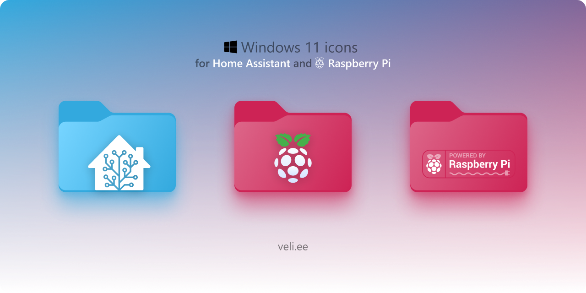
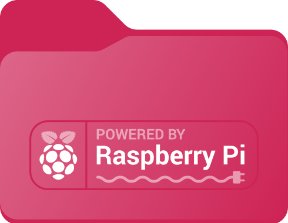
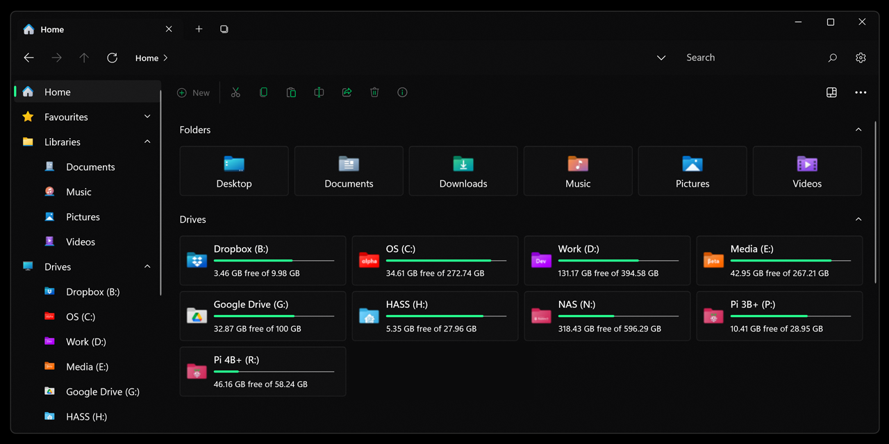

# Home Assistant desktop icons

Windows 11 Drive / Folder icons for [Home Assistant](https://home-assistant.io/) and [Raspberry Pi](https://www.raspberrypi.com/)

- ## [*.ico 👉](./.ico)
- ## [*.svg 👉](./.svg)

|  |  | 
|------------------------------------------------------------------------------------------|----------------------------------------------------------------------------------------------------------------------------------------|---------------------------------------------------------------------------------------|

## Windows 11 preview

***

### macOS? linux?

🤝 refer me to macOS or linux icon templates/guidelines and I'll create them
