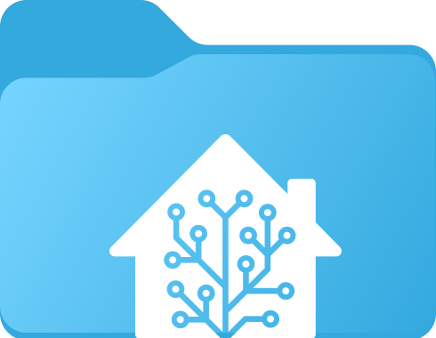

# Home Assistant desktop icons

## *Unofficial*  Drive / Folder icons for [)](https://github.com/home-assistant) and [)](https://github.com/raspberrypi). 

*I just wanted my mapped network drives to look nice.*

## [👉 *.ico](./.ico)

| [*.svg 👉](./.svg) |  |  | 
|------------------------------------------------------------------------------------------|----------------------------------------------------------------------------------------------------------------------------------------|---------------------------------------------------------------------------------------|---------------------------------------------------------------------------------------|

### Windows 11 preview

***

### macOS? linux?

🤝 refer me to macOS or linux icon templates/guidelines and I'll create them
